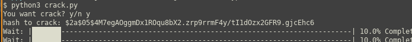
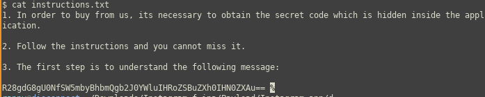
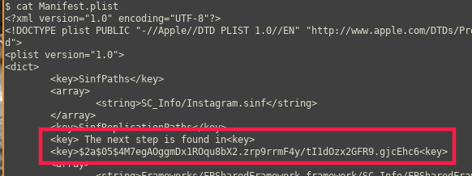
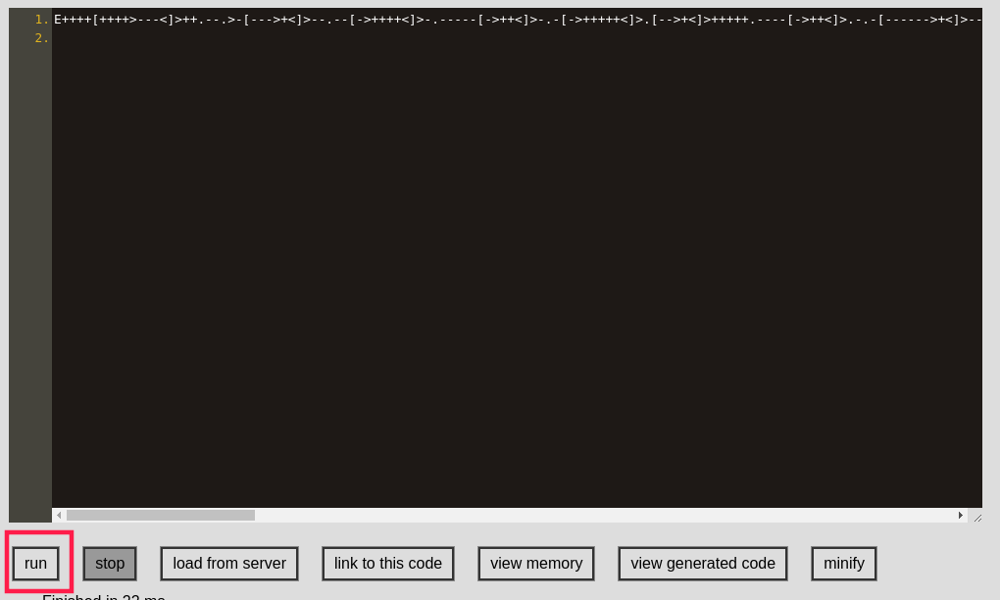
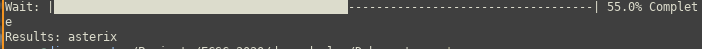
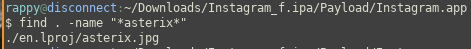
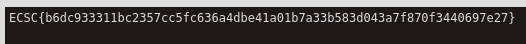
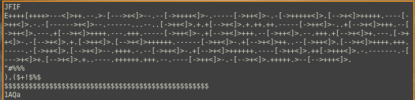
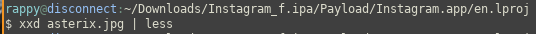

# Warm-up
- Flag: `ECSC{b6dc933311bc2357cc5fc636a4dbe41a01b7a33b583d043a7f870f3440697e27}`
- Category: `mobile`
- Points: `183`

## Summary
Follow the instructions, crack a BCrypt has then run a Brainfuck code to get the flag

## Proof of Solving
In the description of the challenge we are told that the `d` directory wasn’t there when the files were stolen so we take a look there first.
Here we have a `instructions.txt`:

`R28gdG8gU0NfSW5mbyBhbmQgb2J0YWluIHRoZSBuZXh0IHN0ZXAu==`

Let’s decode this base64:

`$ echo "R28gdG8gU0NfSW5mbyBhbmQgb2J0YWluIHRoZSBuZXh0IHN0ZXAu==" | base64 --decode`

So now we go to `SC_Info` and we cat `Manifest.plist` and we get the next step that is a BCrypt hash:

`$2a$05$4M7egAOggmDx1ROqu8bX2.zrp9rrmF4y/tI1dOzx2GFR9.gjcEhc6`

We use Debcrypt to crack this BCrypt hash:

And the result is: `asterix`

Let’s see if we can find any file with this name.

`$ find . -name "*asterix*"`

And we got this image that looks pretty normal:

Let’s take a look inside. We’ll use `strings` on it.

`$ strings asterix.jpg | less`

And now we can see that the header is a bit weird and it looks like is a Brainfuck code. Let’s try to run it (https://copy.sh/brainfuck/):

And we got the flag.
