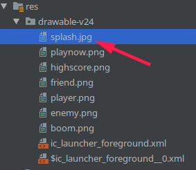
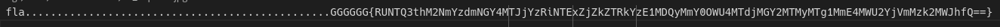
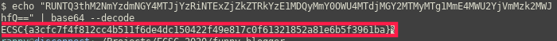

# Flag-is-hidden
- Flag: `ECSC{a3cfc7f4f812cc4b511f6de4dc150422f49e817c0f61321852a81e6b5f3961ba}`
- Category: `mobile`
- Points: `152`

## Summary
Stegcrack on image that keeps the flag hidden.

## Proof of Solving
Open the provided files in android studio and we will see in `res/drawable-v24` some PNG files and just a JPG one that tells us that `FLAG IS HIDDEN HERE`

We use stegcracker on this image to see if we can get something:

And we got this:

`fla................................................GGGGGG{RUNTQ3thM2NmYzdmNGY4MTJjYzRiNTExZjZkZTRkYzE1MDQyMmY0OWU4MTdjMGY2MTMyMTg1MmE4MWU2YjVmMzk2MWJhfQ==}`
Let’s decode this base64...

`$ echo "RUNTQ3thM2NmYzdmNGY4MTJjYzRiNTExZjZkZTRkYzE1MDQyMmY0OWU4MTdjMGY2MTMyMTg1MmE4MWU2YjVmMzk2MWJhfQ==" | base64 --decode`
...and here is the flag.
