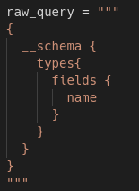
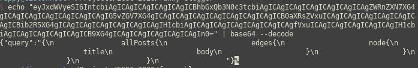
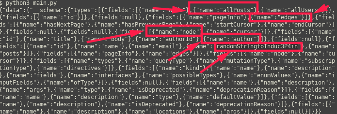
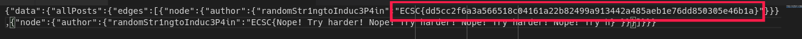
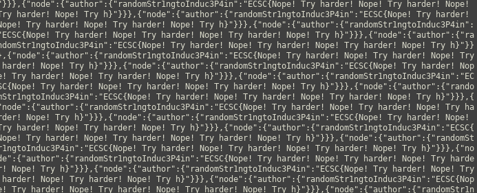
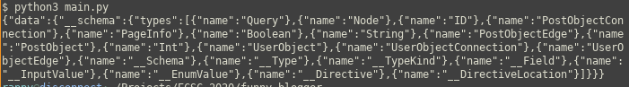
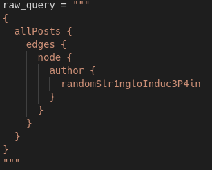

# Funny-blogger
- Flag: `ECSC{dd5cc2f6a3a566518c04161a22b82499a913442a485aeb1e76dd850305e46b1a}`
- Category: `web`
- Points: `241`

## Summary
After I got the GraphQL endpoint, introspection of DB schema, query on suspicious randomStr1ngtoInduc3P4in field and getting the flag from returned data.

## Proof of Solving
`$ curl -vvv http://104.248.42.88:4446/`

We can see that we have some js script with an ajax call to the `/query` endpoint and some base64 query data:

After we decode the base64, we can see that the sent data is acually a GraphQL query encoded with base64. So let’s make a script so we can send requests easily.

Used script attached (`src/1.py`)
First, we need to introspect the DB with two queries:

To get the types:

To get the fields:

We see the `randomStr1ngtoInduc3P4in` field so we’ll make a query for this.

We are spammed with Try harder. Let’s take this output and delete all `{"node":{"author":{"randomStr1ngtoInduc3P4in":"ECSC{Nope! Try harder! Nope! Try harder! Nope! Try harder! Nope! Try h}"}}},`

...and we are left with this:

...the flag.
