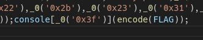
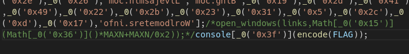
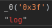
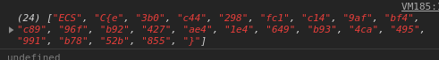
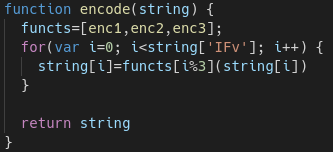
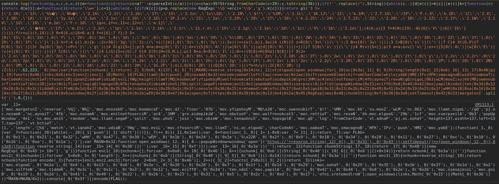
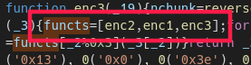

# JS-magic
- Flag: `ECSC{e3b0c44298fc1c149afbf4c8996fb92427ae41e4649b934ca495991b7852b855}`
- Category: `web`
- Points: `254`

## Summary
Analyzing and understanding the downloaded js code and after some trial and error, changing the order of encryption functions.

## Proof of Solving
We got some js code

Let’s see what it returns. We replace the eval with console.log and execute it.

So we got another js code
Let’s inspect it a bit.

We see that we have a `FLAG` variable here and a console variable with some method attached.
If we evaluate `_0(‘0x3f’)`, we will get `log` so here we call console.log. Let’s see what encode function does.

After some variable renaming and some indentation, we can see that encode function iterates through 3 encryption functions and execute those on each string from `FLAG` array.

After some trial and error, I found that if we change the order of encryption functions, we get something interesting in the output. (You can comment out that open_windows function)

Change the order of encryption functions to enc2 -> enc1 -> enc3 and run the code.

We got an array that looks like a flag:

Let’s make it a string with join(‘’):

There is the flag.
