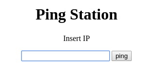
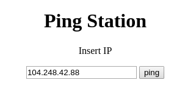
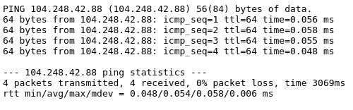
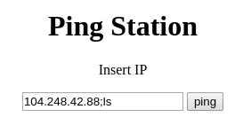
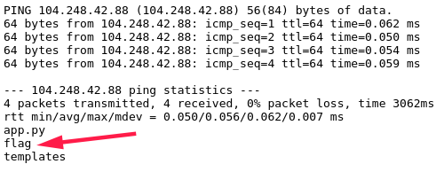
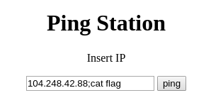

# Ping-station
- Flag: `ECSC{3982de3c146151cafa11b0c9892281b6fe52b0c35d4281be0e43dc5b0c7f29dc}`
- Category: `web`
- Points: `50`

## Summary
We can inject shell code in the input, after the IP.

## Proof of Solving
Go to: `http://104.248.42.88:6960/` (If this still works when you read this writeup)
We get a simple input and a submit button:

If we submit an IP, we will get some ping output

Let’s try to inject some shell code:

The ls command was successfully executed and we got a file called `flag` in current directory. Let’s see what is inside.

Aaand...we got the flag.
